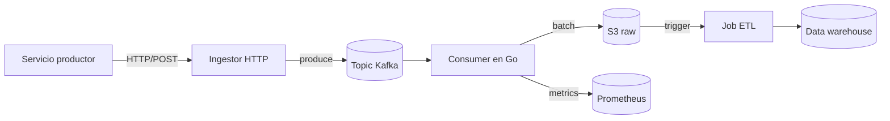

[TOC]

## Resumen

Este documento es la guía de operación del pipeline de ingesta de eventos
hacia el data lake. Cubre arquitectura, flujos de incidente más comunes y
procedimientos verificados para el equipo de on-call.

> **Importante:** mantener este documento sincronizado con el playbook de PagerDuty.
> Cualquier cambio operativo debe reflejarse aquí antes del fin del turno.

## Arquitectura

### Diagrama del flujo



### Componentes

| Componente   | Lenguaje | Repo                     | Owner   |
|--------------|----------|--------------------------|---------|
| Ingestor     | Go 1.22  | `platform/ingestor`      | Datos   |
| Consumer     | Go 1.22  | `platform/event-consumer`| Datos   |
| Job ETL      | Python   | `platform/etl-jobs`      | Datos   |
| Dashboard    | TS/React | `frontend/ops-dash`      | Plataforma |

## Configuración del consumer

El consumer arranca con una configuración YAML que el operador puede editar
en tiempo de incidente. Ejemplo mínimo:

```yaml
kafka:
  brokers:
    - kafka-1.internal:9092
    - kafka-2.internal:9092
    - kafka-3.internal:9092
  topic: events.v3
  group_id: event-consumer
batch:
  max_size: 500
  flush_interval: 5s
sink:
  type: s3
  bucket: events-raw-prod
```

Para emitir un token de servicio reutilizado por los componentes:

```go
package auth

import (
    "time"

    "github.com/golang-jwt/jwt/v5"
)

// issueServiceToken emite un JWT de servicio con TTL corto.
func issueServiceToken(svc string, key []byte) (string, error) {
    claims := jwt.MapClaims{
        "sub": svc,
        "iss": "platform-auth",
        "exp": time.Now().Add(10 * time.Minute).Unix(),
    }
    return jwt.NewWithClaims(jwt.SigningMethodHS256, claims).SignedString(key)
}
```

## Procedimientos de on-call

### Reiniciar el consumer

Solo si las métricas confirman que está realmente atascado (lag > 100k por más
de 5 minutos):

```bash
# 1. Drenar tráfico controladamente
kubectl scale deploy/event-consumer --replicas=0 -n data
sleep 30

# 2. Revisar último offset commiteado
kafka-consumer-groups --bootstrap-server kafka-1.internal:9092 \
    --describe --group event-consumer

# 3. Reanudar
kubectl scale deploy/event-consumer --replicas=3 -n data
```

### Validar un evento entrante

Mientras se diagnostica, conviene tener a mano un payload válido para inyectar:

```json
{
  "event_id": "evt_5f8c2a1d",
  "type": "user.signup",
  "occurred_at": "2026-05-13T18:42:00Z",
  "actor": { "user_id": "u_abc123" },
  "payload": { "channel": "organic" }
}
```

## Tareas pendientes

- [x] Documentar el flujo de rollback de offsets
- [x] Agregar métrica de _consumer lag_ por partición
- [ ] Probar el path de recuperación con tráfico al 200% del pico
- [ ] Automatizar el restart con un runbook ejecutable

## Anexo: imagen de referencia


*Imagen incluida únicamente para validar el renderizado en el PDF.*

## Referencias

- [Especificación interna del topic events.v3](https://internal.example.com/specs/events-v3)
- [Política de retención del data lake](https://internal.example.com/policies/retention)
- Runbook PagerDuty: `PLAT-ONCALL-DATA`
